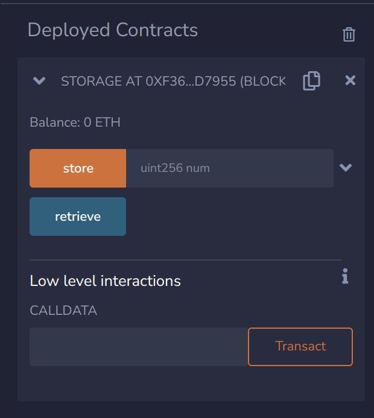

# Remix-proxy
Proxy Thor's RESTful API to Eth JSON-RPC, to support Remix IDE.

# Running in solo mode

## Fetch dependencies
```bash
npm install
```

## Start Thor
You need to have Thor running locally in solo mode for this example to work. Find out more about Thors different options and how to build it [here](https://github.com/vechain/thor).

## Setup config
The following config will setup the proxy to work out of the box with Thor in solo mode running locally on the same machine.

```
{
    "url": "http://127.0.0.1:8669",
    "port": 8545,
    "accounts": {
      "mnemonic": "denial kitchen pet squirrel other broom bar gas better priority spoil cross",
      "count": 10
    }
  }
```

## Run proxy
```bash
node index.js
```

## Connect with Remix

### 1. Go to `DEPLOY & RUN TRANSACTIONS` section


### 2. Choose Custom - External HTTP provider


### 3. Choose the URL to your proxy (default is http://127.0.0.1:8545) and click Ok


### 4. Compile and deploy contracts


### 5. Interact with contracts via provided interface




# Known Issues
Currently there are some limitations when using this proxy. One of them is the fact that when deploying contracts you could get an error of the following type `creation of ContractName errored: [TIMEOUT] Timeout for call deployMetadataOf from udapp`. This usually happens after 3 or more deployments one after another.

# Workaround
Fortunately there is a workaround for this, if all contracts are required in the same workspace. When deploying contracts note their address as well as the contract name. When you get the aforementioned error refresh Remix and recompile the contracts. When navigating to the `DEPLOY & RUN TRANSACTIONS` section instead of re-deploying the contract paste the address in the `AtAddress` section and it will load from your previous deployment. You can now succesfully interact with a previously deployed contract.


